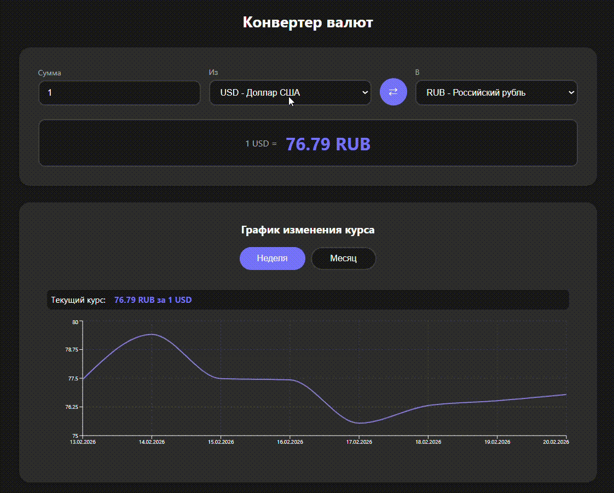

# 💱 Currency Converter - React PWA Application

[](https://reactjs.org)
[](https://typescriptlang.org)
[](https://recharts.org)
[](https://web.dev/progressive-web-apps/)
[](https://www.exchangerate-api.com/)
[](https://developer.mozilla.org/en-US/docs/Learn/CSS/CSS_layout/Responsive_Design)

Современное PWA-приложение для конвертации валют с **реальными курсами**, интерактивными графиками и темной темой. Полностью на русском языке.

##  Ключевые особенности

-  Реальные курсы валют через ExchangeRate-API
-  Умные графики - сегодняшняя точка = реальный курс, остальные дни = реалистичные колебания
-  Темная тема с автоматическим сохранением выбора в localStorage
-  PWA (Progressive Web App) - можно установить на телефон как нативное приложение
-  Автосохранение последних выбранных валют
-  Полная поддержка русского языка (интерфейс, даты, подписи)
-  Адаптивный дизайн - идеально на всех устройствах

##  Демо

### [Посмотреть демо на GitHub Pages](https://lina-whm.github.io/currency-converter/)

## Демонстрация работы



**Скриншоты:**

| Светлая тема | Темная тема | Мобильная версия |
|--------------|------------|------------------|
|  |  |  |

##  Технологический стек

### Frontend
- **React 19** - современные хуки, функциональные компоненты
- **TypeScript** - строгая типизация, интерфейсы
- **Recharts** - красивые и отзывчивые графики
- **CSS Modules** - изолированные стили без конфликтов
- **Context API** - глобальное управление темой
- **LocalStorage** - сохранение пользовательских настроек

### API и данные
- **ExchangeRate-API** - реальные курсы валют
- **Собственный алгоритм** - генерация реалистичных исторических данных на основе текущего курса

### Инфраструктура
- **PWA** - manifest.json, service worker, установка на устройства
- **GitHub Pages** - автоматический деплой
- **Jest + Testing Library** - unit-тестирование компонентов

## Как работают графики

| Компонент | Что показывает |
|-----------|----------------|
| **Ось X** | Даты (ДД.ММ.ГГГГ) |
| **Ось Y** | Курс в целевой валюте (например, рубли за 1 доллар) |
| **Сегодня** |  **Реальный курс из API** |
| **Прошлые дни** |  Реалистичные колебания вокруг реального курса |
| **Тултип** | При наведении показывает дату и полную информацию на русском |

## Быстрый старт

### Требования
- Node.js 18+
- npm или yarn
- API ключ от [ExchangeRate-API](https://www.exchangerate-api.com/) (бесплатно)

### Установка

```bash
# клонировать репозиторий
git clone https://github.com/lina-whm/currency-converter.git
cd currency-converter

# установить зависимости
npm install

# запустить проект
npm start